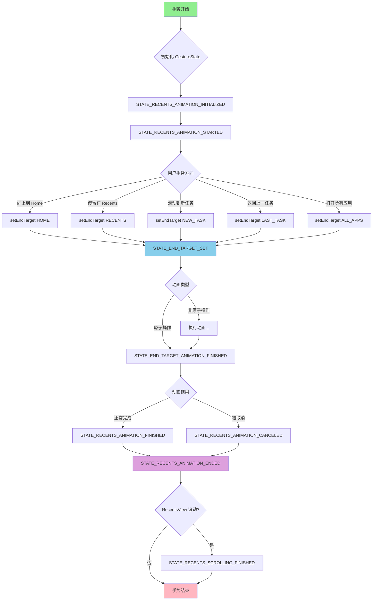
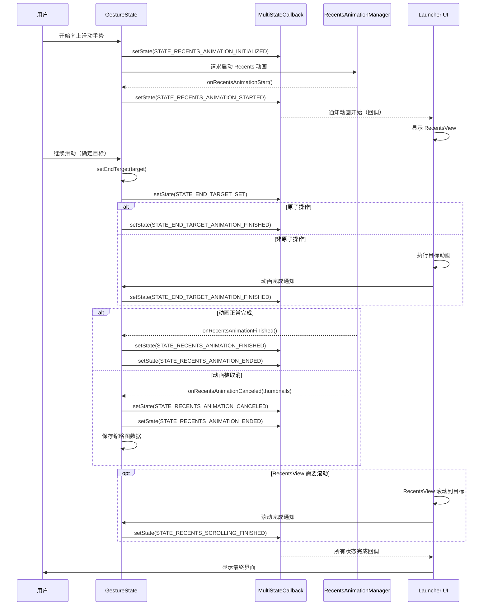
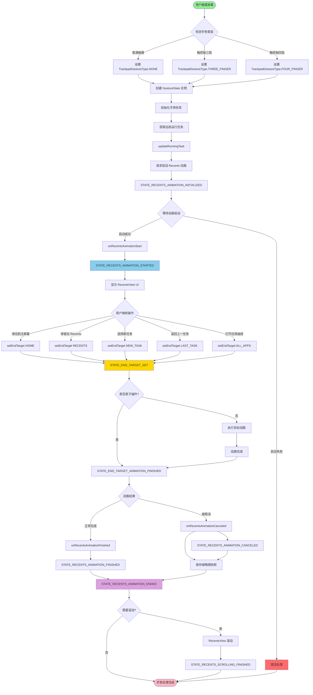

# GestureState 类详细分析

## 目录
- [1. 类概述](#1-类概述)
- [2. 核心作用](#2-核心作用)
- [3. 主要组件](#3-主要组件)
- [4. 状态机制详解](#4-状态机制详解)
- [5. 手势结束目标](#5-手势结束目标)
- [6. 关键方法分析](#6-关键方法分析)
- [7. 状态转换流程图](#7-状态转换流程图)
- [8. Recents 动画时序图](#8-recents-动画时序图)
- [9. 手势处理流程图](#9-手势处理流程图)
- [10. 使用场景](#10-使用场景)
- [11. 总结](#11-总结)

---

## 1. 类概述

**位置**: `com.android.quickstep.GestureState`
**继承关系**: `implements RecentsAnimationCallbacks.RecentsAnimationListener`
**源文件**: `quickstep/src/com/android/quickstep/GestureState.java`

### 类定义
```java
public class GestureState implements RecentsAnimationCallbacks.RecentsAnimationListener
```

GestureState 是 Android Launcher3 Quickstep 中用于管理系统手势状态的核心类。它负责跟踪和协调用户手势操作（如向上滑动切换应用、返回主屏幕等）的整个生命周期。

---

## 2. 核心作用

GestureState 主要承担以下职责：

### 2.1 状态管理
- 管理手势执行过程中的各种状态标志
- 通过 `MultiStateCallback` 机制协调异步事件
- 追踪手势从开始到结束的完整生命周期

### 2.2 事件监听
- 监听系统 Recents 动画的启动、取消、完成事件
- 监听 Launcher 界面状态变化
- 响应用户手势输入事件

### 2.3 任务信息管理
- 维护当前运行任务信息 (`mRunningTask`)
- 跟踪最近出现的任务 (`mLastAppearedTaskTargets`)
- 记录最近启动的任务 ID (`mLastStartedTaskId`)

### 2.4 手势目标确定
- 确定手势的最终目标（HOME、RECENTS、NEW_TASK 等）
- 根据手势类型（触摸屏、触控板三指/四指）进行相应处理
- 协调动画和 UI 转换

---

## 3. 主要组件

### 3.1 核心成员变量

| 成员变量 | 类型 | 作用 |
|---------|------|------|
| `mStateCallback` | MultiStateCallback | 管理状态回调，协调异步事件 |
| `mGestureId` | int | 唯一标识当前手势 |
| `mDisplayId` | int | 手势发生的显示屏 ID |
| `mRunningTask` | CachedTaskInfo | 当前运行的任务信息 |
| `mEndTarget` | GestureEndTarget | 手势的最终目标状态 |
| `mHomeIntent` | Intent | 主屏幕 Intent |
| `mOverviewIntent` | Intent | 最近任务 Intent |
| `mContainerInterface` | BaseContainerInterface | UI 更新接口 |
| `mTrackpadGestureType` | TrackpadGestureType | 触控板手势类型 |
| `mSwipeUpStartTimeMs` | long | 向上滑动手势触发时间 |

### 3.2 关键枚举类型

#### GestureEndTarget（手势结束目标）
```java
public enum GestureEndTarget {
    HOME,        // 返回主屏幕
    RECENTS,     // 进入最近任务
    NEW_TASK,    // 切换到新任务
    LAST_TASK,   // 返回上一个任务
    ALL_APPS     // 打开所有应用
}
```

#### TrackpadGestureType（触控板手势类型）
```java
public enum TrackpadGestureType {
    NONE,          // 非触控板手势
    THREE_FINGER,  // 三指手势
    FOUR_FINGER    // 四指手势
}
```

---

## 4. 状态机制详解

### 4.1 状态标志定义

GestureState 定义了 8 个核心状态标志，使用位掩码机制管理：

| 状态常量 | 含义 | 触发时机 |
|---------|------|---------|
| `STATE_END_TARGET_SET` | 结束目标已设置 | 确定手势最终目标时 |
| `STATE_END_TARGET_ANIMATION_FINISHED` | 结束动画已完成 | 目标动画执行完毕 |
| `STATE_RECENTS_ANIMATION_INITIALIZED` | Recents 动画已初始化 | 请求开始 Recents 动画 |
| `STATE_RECENTS_ANIMATION_STARTED` | Recents 动画已启动 | TaskAnimationManager 更新完成 |
| `STATE_RECENTS_ANIMATION_CANCELED` | Recents 动画已取消 | 动画被中断取消 |
| `STATE_RECENTS_ANIMATION_FINISHED` | Recents 动画已完成 | 动画正常结束 |
| `STATE_RECENTS_ANIMATION_ENDED` | Recents 动画已结束 | 动画结束（无论取消或完成） |
| `STATE_RECENTS_SCROLLING_FINISHED` | Recents 滚动已结束 | RecentsView 停止滚动并固定 |

### 4.2 状态管理方法

```java
// 检查是否包含某个状态
public boolean hasState(int stateMask)

// 设置状态标志
public void setState(int stateFlag)

// 在指定状态时执行回调
public void runOnceAtState(int stateMask, Runnable callback)
```

### 4.3 状态标志生成机制

```java
private static int getNextStateFlag(String name) {
    if (DEBUG_STATES) {
        STATE_NAMES.add(name);  // 调试模式下记录状态名称
    }
    int index = 1 << FLAG_COUNT;  // 使用位移生成唯一标志
    FLAG_COUNT++;
    return index;
}
```

这种机制允许：
- 使用单个整数表示多个状态的组合
- 高效的位运算检查状态
- 便于调试和日志记录

---

## 5. 手势结束目标

### 5.1 GestureEndTarget 详解

每个结束目标包含三个关键属性：

```java
GestureEndTarget(boolean isLauncher, int containerType, boolean recentsAttachedToAppWindow)
```

| 目标 | isLauncher | containerType | recentsAttachedToAppWindow | 说明 |
|------|------------|---------------|----------------------------|------|
| HOME | true | LAUNCHER_STATE_HOME | false | 返回 Launcher 主屏幕 |
| RECENTS | true | LAUNCHER_STATE_OVERVIEW | true | 显示最近任务视图 |
| NEW_TASK | false | LAUNCHER_STATE_BACKGROUND | true | 切换到新应用 |
| LAST_TASK | false | LAUNCHER_STATE_BACKGROUND | true | 返回上一个任务 |
| ALL_APPS | true | LAUNCHER_STATE_ALLAPPS | false | 打开所有应用抽屉 |

### 5.2 属性说明

- **isLauncher**: 目标是否在 Launcher 活动中
  - `true`: 不能中断动画启动其他手势
  - `false`: 允许继续其他手势操作

- **containerType**: 用于日志记录用户最终位置
  - 帮助统计用户行为和手势使用情况

- **recentsAttachedToAppWindow**: RecentsView 是否应该附加到窗口
  - 决定动画期间 RecentsView 的显示方式

---

## 6. 关键方法分析

### 6.1 构造方法

```java
// 主构造方法
public GestureState(OverviewComponentObserver componentObserver, int displayId, int gestureId)

// 拷贝构造方法
public GestureState(GestureState other)

// 默认构造方法（用于用户未解锁前）
public GestureState()
```

### 6.2 任务管理方法

#### updateRunningTask
```java
public void updateRunningTask(@NonNull CachedTaskInfo runningTask)
```
更新当前手势相关的运行任务信息。

#### getRunningTaskIds
```java
public int[] getRunningTaskIds(boolean getMultipleTasks)
```
获取运行任务的 ID 数组，支持分屏模式的多任务场景。

#### updateLastAppearedTaskTargets
```java
public void updateLastAppearedTaskTargets(RemoteAnimationTarget[] lastAppearedTaskTargets)
```
更新在手势过程中出现的任务目标，并维护历史记录。

### 6.3 目标设置方法

#### setEndTarget
```java
public void setEndTarget(GestureEndTarget target, boolean isAtomic)
```

**参数说明**：
- `target`: 手势的结束目标
- `isAtomic`: 是否为原子操作
  - `true`: 立即设置 `STATE_END_TARGET_ANIMATION_FINISHED`
  - `false`: 调用者需要手动设置动画完成状态

**执行流程**：
1. 设置 `mEndTarget`
2. 触发 `STATE_END_TARGET_SET` 状态
3. 记录日志（根据不同目标类型）
4. 如果是原子操作，立即触发 `STATE_END_TARGET_ANIMATION_FINISHED`

### 6.4 RecentsAnimationListener 实现

#### onRecentsAnimationStart
```java
@Override
public void onRecentsAnimationStart(RecentsAnimationController controller,
        RecentsAnimationTargets targets, TransitionInfo info)
```
当 Recents 动画启动时被调用，设置 `STATE_RECENTS_ANIMATION_STARTED` 状态。

#### onRecentsAnimationCanceled
```java
@Override
public void onRecentsAnimationCanceled(HashMap<Integer, ThumbnailData> thumbnailDatas)
```
处理 Recents 动画取消：
1. 保存缩略图数据
2. 设置 `STATE_RECENTS_ANIMATION_CANCELED`
3. 设置 `STATE_RECENTS_ANIMATION_ENDED`
4. 清理缩略图数据

#### onRecentsAnimationFinished
```java
@Override
public void onRecentsAnimationFinished(RecentsAnimationController controller)
```
处理 Recents 动画正常完成：
1. 设置 `STATE_RECENTS_ANIMATION_FINISHED`
2. 设置 `STATE_RECENTS_ANIMATION_ENDED`

### 6.5 状态查询方法

#### isRunningAnimationToLauncher
```java
public boolean isRunningAnimationToLauncher()
```
检查是否正在运行到 Launcher 的动画。

#### isRecentsAnimationRunning
```java
public boolean isRecentsAnimationRunning()
```
检查 Recents 动画是否正在运行（已启动但未结束）。

### 6.6 触控板手势相关

```java
public void setTrackpadGestureType(TrackpadGestureType trackpadGestureType)
public boolean isTrackpadGesture()
public boolean isThreeFingerTrackpadGesture()
public boolean isFourFingerTrackpadGesture()
```

支持区分：
- 普通触摸屏手势
- 触控板三指手势
- 触控板四指手势

---

## 7. 状态转换流程图



---

## 8. Recents 动画时序图



---

## 9. 手势处理流程图



---

## 10. 使用场景

### 10.1 场景一：向上滑动返回主屏幕

```java
// 1. 创建 GestureState
GestureState gestureState = new GestureState(componentObserver, displayId, gestureId);

// 2. 更新运行任务
gestureState.updateRunningTask(currentTask);

// 3. 初始化动画
gestureState.setState(STATE_RECENTS_ANIMATION_INITIALIZED);

// 4. 动画启动回调
gestureState.onRecentsAnimationStart(controller, targets, info);

// 5. 设置结束目标为 HOME
gestureState.setEndTarget(GestureEndTarget.HOME);

// 6. 动画完成
gestureState.onRecentsAnimationFinished(controller);
```

### 10.2 场景二：滑动到最近任务

```java
// 1-4 步骤同上

// 5. 设置结束目标为 RECENTS，非原子操作
gestureState.setEndTarget(GestureEndTarget.RECENTS, false);

// 6. 显示 RecentsView 并等待用户滚动
// ...

// 7. 滚动完成
gestureState.setState(STATE_RECENTS_SCROLLING_FINISHED);

// 8. 手动设置动画完成
gestureState.setState(STATE_END_TARGET_ANIMATION_FINISHED);

// 9. 动画结束
gestureState.onRecentsAnimationFinished(controller);
```

### 10.3 场景三：切换到新任务

```java
// 1-4 步骤同上

// 5. 更新最后出现的任务
gestureState.updateLastAppearedTaskTargets(appearedTargets);

// 6. 设置结束目标为 NEW_TASK
gestureState.setEndTarget(GestureEndTarget.NEW_TASK);

// 7. 更新最后启动的任务 ID
gestureState.updateLastStartedTaskIds(new int[]{taskId, INVALID_TASK_ID});

// 8. 动画完成
gestureState.onRecentsAnimationFinished(controller);
```

### 10.4 场景四：动画被取消

```java
// 1-5 步骤同常规流程

// 6. 动画被系统或用户取消
HashMap<Integer, ThumbnailData> thumbnails = new HashMap<>();
gestureState.onRecentsAnimationCanceled(thumbnails);

// 7. 消费缩略图数据（用于恢复界面）
HashMap<Integer, ThumbnailData> snapshot =
    gestureState.consumeRecentsAnimationCanceledSnapshot();

// 8. 使用快照恢复界面
if (snapshot != null) {
    // 显示快照...
    // 清理资源...
}
```

### 10.5 场景五：触控板手势

```java
// 1. 创建 GestureState
GestureState gestureState = new GestureState(componentObserver, displayId, gestureId);

// 2. 检测触控板手势类型
TrackpadGestureType gestureType =
    TrackpadGestureType.getTrackpadGestureType(motionEvent);

// 3. 设置手势类型
gestureState.setTrackpadGestureType(gestureType);

// 4. 根据手势类型执行不同逻辑
if (gestureState.isThreeFingerTrackpadGesture()) {
    // 三指手势：切换应用
    gestureState.setEndTarget(GestureEndTarget.NEW_TASK);
} else if (gestureState.isFourFingerTrackpadGesture()) {
    // 四指手势：显示所有应用
    gestureState.setEndTarget(GestureEndTarget.ALL_APPS);
}
```

---

## 11. 总结

### 11.1 核心优势

1. **状态集中管理**
   - 使用 `MultiStateCallback` 实现状态的统一管理
   - 支持状态组合和位运算，高效灵活

2. **异步事件协调**
   - 通过状态回调机制协调系统动画、UI 更新、用户输入
   - 避免竞态条件和时序问题

3. **可扩展性**
   - 枚举定义明确的手势目标和类型
   - 易于添加新的手势类型或结束目标

4. **调试友好**
   - 提供 `dump()` 方法输出完整状态信息
   - 支持 DEBUG_STATES 模式记录状态名称
   - 集成 ActiveGestureLog 进行事件追踪

### 11.2 关键设计模式

1. **状态模式（State Pattern）**
   - 使用位标志管理多个状态
   - 状态转换清晰可追踪

2. **观察者模式（Observer Pattern）**
   - `RecentsAnimationListener` 接口监听动画事件
   - `MultiStateCallback` 实现状态变化通知

3. **单一职责原则**
   - 专注于手势状态管理
   - 不涉及具体 UI 实现或动画逻辑

### 11.3 与其他组件的协作

```
用户输入
    ↓
TouchInteractionHandler (处理触摸事件)
    ↓
GestureState (管理手势状态) ←→ MultiStateCallback (状态回调)
    ↓                              ↓
RecentsAnimationController ←→ Launcher UI
    ↓
SystemUI / WindowManager (系统动画)
```

### 11.4 注意事项

1. **线程安全**
   - GestureState 的状态修改应在主线程进行
   - 动画回调可能在不同线程触发

2. **内存管理**
   - 及时清理缩略图数据 (`mRecentsAnimationCanceledSnapshots`)
   - 避免持有大对象引用造成内存泄漏

3. **状态一致性**
   - 确保状态转换的逻辑正确性
   - 动画取消和完成是互斥的最终状态

4. **错误处理**
   - 集成 `ActiveGestureErrorDetector` 进行错误检测
   - 提供完整的日志和调试信息

### 11.5 性能优化

1. **位运算优化**
   - 使用位掩码实现状态检查，O(1) 时间复杂度

2. **延迟初始化**
   - 缩略图数据只在需要时保存和消费

3. **事件去重**
   - `runOnceAtState` 确保回调只执行一次

### 11.6 典型问题排查

| 问题现象 | 可能原因 | 排查方法 |
|---------|---------|---------|
| 手势无响应 | 状态未正确设置 | 检查 `dump()` 输出的状态标志 |
| 动画卡住 | 回调未触发 | 查看 `isRecentsAnimationRunning()` |
| 任务切换失败 | RunningTask 未更新 | 检查 `mRunningTask` 和 `mLastStartedTaskId` |
| 界面闪烁 | 缩略图处理不当 | 检查 `consumeRecentsAnimationCanceledSnapshot()` |

---

## 附录：相关类和接口

### A. MultiStateCallback
管理多个状态标志和回调的工具类。

### B. RecentsAnimationCallbacks.RecentsAnimationListener
```java
interface RecentsAnimationListener {
    void onRecentsAnimationStart(RecentsAnimationController controller,
            RecentsAnimationTargets targets, TransitionInfo info);
    void onRecentsAnimationCanceled(HashMap<Integer, ThumbnailData> thumbnailDatas);
    void onRecentsAnimationFinished(RecentsAnimationController controller);
}
```

### C. BaseContainerInterface
提供 Launcher 容器的接口，用于 UI 更新。

### D. CachedTaskInfo
缓存的任务信息，包含任务 ID、Intent、组件名等。

### E. ActiveGestureLog
用于追踪和记录手势事件，便于调试和性能分析。

---

**文档版本**: 1.0
**生成时间**: 2025-12-09
**适用版本**: Android Launcher3 (基于 AOSP)
